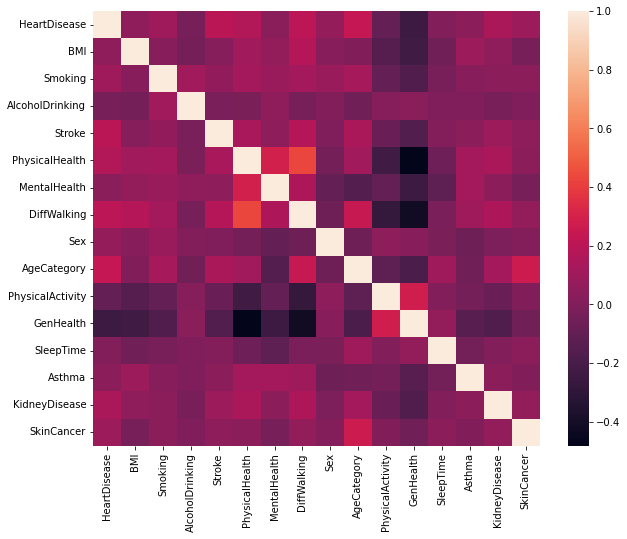
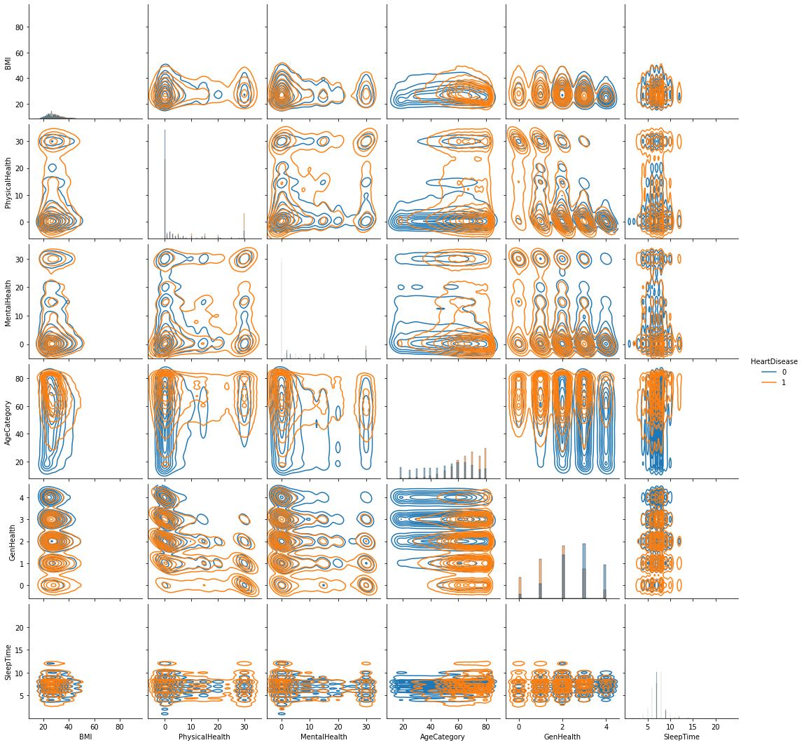
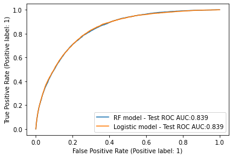

# Introduction to Machine Learning: Supervised Learning
## Final project

## EDA and modelling heart disease information

This notebook contains an exploratory analysis of the *Personal Key Indicators of Heart Disease* dataset from the CDC available on <a href=https://www.kaggle.com/datasets/kamilpytlak/personal-key-indicators-of-heart-disease>Kaggle</a>, the construction of a random forest clasiffier trained to predict if patients reported heart disease in their lifetimes, and an exploration of the resulting model.<br>
Good understanding of factors related to heart disease is of great importance, as it allows to take preventive action and early treatment of heart problems. This notebook is focused on developing a robust model to predict coronary heart disease or myocardial infarction and in understanding the factors related to disease.

## Imports


```python
import pandas as pd
import numpy as np
import matplotlib.pyplot as plt
import seaborn as sns
import datetime
from boruta import BorutaPy
from sklearn.ensemble import RandomForestClassifier
from sklearn.tree import DecisionTreeClassifier
from sklearn.linear_model import LogisticRegression
from sklearn.metrics import (
    make_scorer,
    roc_auc_score,
    RocCurveDisplay,
    plot_confusion_matrix,
    roc_curve,
)
from sklearn.preprocessing import StandardScaler
from sklearn.model_selection import train_test_split, GridSearchCV, cross_val_score
import shap
```


```python
import warnings

warnings.filterwarnings("ignore")
```


```python
%matplotlib inline
%load_ext nb_black
```


    <IPython.core.display.Javascript object>


## EDA

Load data


```python
data = pd.read_csv("../Data/heart_2020_cleaned.csv")
```


    <IPython.core.display.Javascript object>


Transform binary and ordinal attributes into integers for analysis and modelling


```python
ser = data["Diabetic"].copy()
data.replace({"Yes": 1, "No": 0}, inplace=True)
data["Diabetic"] = ser
```


    <IPython.core.display.Javascript object>


```python
data["AgeCategory"].unique()
```


    array(['55-59', '80 or older', '65-69', '75-79', '40-44', '70-74',
           '60-64', '50-54', '45-49', '18-24', '35-39', '30-34', '25-29'],
          dtype=object)


    <IPython.core.display.Javascript object>


```python
data["AgeCategory"] = data["AgeCategory"].apply(lambda x: int(x[:2]))
```


    <IPython.core.display.Javascript object>


```python
data["GenHealth"].unique()
```


    array(['Very good', 'Fair', 'Good', 'Poor', 'Excellent'], dtype=object)


    <IPython.core.display.Javascript object>


```python
data["Sex"].unique()
```


    array(['Female', 'Male'], dtype=object)


    <IPython.core.display.Javascript object>


```python
health_map = {"Poor": 0, "Fair": 1, "Good": 2, "Very good": 3, "Excellent": 4}
sex_map = {"Female": 0, "Male": 1}
```


    <IPython.core.display.Javascript object>


```python
data["GenHealth"] = data["GenHealth"].map(health_map)
data["Sex"] = data["Sex"].map(sex_map)
```


    <IPython.core.display.Javascript object>


```python
data.dtypes
```


    HeartDisease          int64
    BMI                 float64
    Smoking               int64
    AlcoholDrinking       int64
    Stroke                int64
    PhysicalHealth      float64
    MentalHealth        float64
    DiffWalking           int64
    Sex                   int64
    AgeCategory           int64
    Race                 object
    Diabetic             object
    PhysicalActivity      int64
    GenHealth             int64
    SleepTime           float64
    Asthma                int64
    KidneyDisease         int64
    SkinCancer            int64
    dtype: object


    <IPython.core.display.Javascript object>


```python
data["Race"].unique()
```


    array(['White', 'Black', 'Asian', 'American Indian/Alaskan Native',
           'Other', 'Hispanic'], dtype=object)


    <IPython.core.display.Javascript object>


```python
data["Diabetic"].unique()
```


    array(['Yes', 'No', 'No, borderline diabetes', 'Yes (during pregnancy)'],
          dtype=object)


    <IPython.core.display.Javascript object>


Data exploration


```python
binary_columns = [
    x for x in data.nunique()[data.nunique() == 2].index if x != "HeartDisease"
]
```


    <IPython.core.display.Javascript object>


```python
binary_columns
```


    ['Smoking',
     'AlcoholDrinking',
     'Stroke',
     'DiffWalking',
     'Sex',
     'PhysicalActivity',
     'Asthma',
     'KidneyDisease',
     'SkinCancer']


    <IPython.core.display.Javascript object>


```python
data.describe()
```


<div>
<style scoped>
    .dataframe tbody tr th:only-of-type {
        vertical-align: middle;
    }

    .dataframe tbody tr th {
        vertical-align: top;
    }

    .dataframe thead th {
        text-align: right;
    }
</style>
<table border="1" class="dataframe">
  <thead>
    <tr style="text-align: right;">
      <th></th>
      <th>HeartDisease</th>
      <th>BMI</th>
      <th>Smoking</th>
      <th>AlcoholDrinking</th>
      <th>Stroke</th>
      <th>PhysicalHealth</th>
      <th>MentalHealth</th>
      <th>DiffWalking</th>
      <th>Sex</th>
      <th>AgeCategory</th>
      <th>PhysicalActivity</th>
      <th>GenHealth</th>
      <th>SleepTime</th>
      <th>Asthma</th>
      <th>KidneyDisease</th>
      <th>SkinCancer</th>
    </tr>
  </thead>
  <tbody>
    <tr>
      <th>count</th>
      <td>319795.000000</td>
      <td>319795.000000</td>
      <td>319795.000000</td>
      <td>319795.000000</td>
      <td>319795.000000</td>
      <td>319795.00000</td>
      <td>319795.000000</td>
      <td>319795.000000</td>
      <td>319795.000000</td>
      <td>319795.000000</td>
      <td>319795.000000</td>
      <td>319795.000000</td>
      <td>319795.000000</td>
      <td>319795.000000</td>
      <td>319795.000000</td>
      <td>319795.000000</td>
    </tr>
    <tr>
      <th>mean</th>
      <td>0.085595</td>
      <td>28.325399</td>
      <td>0.412477</td>
      <td>0.068097</td>
      <td>0.037740</td>
      <td>3.37171</td>
      <td>3.898366</td>
      <td>0.138870</td>
      <td>0.475273</td>
      <td>52.440945</td>
      <td>0.775362</td>
      <td>2.595028</td>
      <td>7.097075</td>
      <td>0.134061</td>
      <td>0.036833</td>
      <td>0.093244</td>
    </tr>
    <tr>
      <th>std</th>
      <td>0.279766</td>
      <td>6.356100</td>
      <td>0.492281</td>
      <td>0.251912</td>
      <td>0.190567</td>
      <td>7.95085</td>
      <td>7.955235</td>
      <td>0.345812</td>
      <td>0.499389</td>
      <td>18.069747</td>
      <td>0.417344</td>
      <td>1.042918</td>
      <td>1.436007</td>
      <td>0.340718</td>
      <td>0.188352</td>
      <td>0.290775</td>
    </tr>
    <tr>
      <th>min</th>
      <td>0.000000</td>
      <td>12.020000</td>
      <td>0.000000</td>
      <td>0.000000</td>
      <td>0.000000</td>
      <td>0.00000</td>
      <td>0.000000</td>
      <td>0.000000</td>
      <td>0.000000</td>
      <td>18.000000</td>
      <td>0.000000</td>
      <td>0.000000</td>
      <td>1.000000</td>
      <td>0.000000</td>
      <td>0.000000</td>
      <td>0.000000</td>
    </tr>
    <tr>
      <th>25%</th>
      <td>0.000000</td>
      <td>24.030000</td>
      <td>0.000000</td>
      <td>0.000000</td>
      <td>0.000000</td>
      <td>0.00000</td>
      <td>0.000000</td>
      <td>0.000000</td>
      <td>0.000000</td>
      <td>40.000000</td>
      <td>1.000000</td>
      <td>2.000000</td>
      <td>6.000000</td>
      <td>0.000000</td>
      <td>0.000000</td>
      <td>0.000000</td>
    </tr>
    <tr>
      <th>50%</th>
      <td>0.000000</td>
      <td>27.340000</td>
      <td>0.000000</td>
      <td>0.000000</td>
      <td>0.000000</td>
      <td>0.00000</td>
      <td>0.000000</td>
      <td>0.000000</td>
      <td>0.000000</td>
      <td>55.000000</td>
      <td>1.000000</td>
      <td>3.000000</td>
      <td>7.000000</td>
      <td>0.000000</td>
      <td>0.000000</td>
      <td>0.000000</td>
    </tr>
    <tr>
      <th>75%</th>
      <td>0.000000</td>
      <td>31.420000</td>
      <td>1.000000</td>
      <td>0.000000</td>
      <td>0.000000</td>
      <td>2.00000</td>
      <td>3.000000</td>
      <td>0.000000</td>
      <td>1.000000</td>
      <td>65.000000</td>
      <td>1.000000</td>
      <td>3.000000</td>
      <td>8.000000</td>
      <td>0.000000</td>
      <td>0.000000</td>
      <td>0.000000</td>
    </tr>
    <tr>
      <th>max</th>
      <td>1.000000</td>
      <td>94.850000</td>
      <td>1.000000</td>
      <td>1.000000</td>
      <td>1.000000</td>
      <td>30.00000</td>
      <td>30.000000</td>
      <td>1.000000</td>
      <td>1.000000</td>
      <td>80.000000</td>
      <td>1.000000</td>
      <td>4.000000</td>
      <td>24.000000</td>
      <td>1.000000</td>
      <td>1.000000</td>
      <td>1.000000</td>
    </tr>
  </tbody>
</table>
</div>


    <IPython.core.display.Javascript object>


```python
column_correlations = data.corr()
```


    <IPython.core.display.Javascript object>


```python
column_correlations["HeartDisease"].sort_values()
```


    GenHealth          -0.243182
    PhysicalActivity   -0.100030
    AlcoholDrinking    -0.032080
    SleepTime           0.008327
    MentalHealth        0.028591
    Asthma              0.041444
    BMI                 0.051803
    Sex                 0.070040
    SkinCancer          0.093317
    Smoking             0.107764
    KidneyDisease       0.145197
    PhysicalHealth      0.170721
    Stroke              0.196835
    DiffWalking         0.201258
    AgeCategory         0.232325
    HeartDisease        1.000000
    Name: HeartDisease, dtype: float64


    <IPython.core.display.Javascript object>


The atributes that have a greater positive correlation with heart disease are the Age, the difficulty walking and past strokes; while the atributes with greater negative correlation are General health and physical activity.


```python
sns.heatmap(data.corr())
fig = plt.gcf()
fig.set_size_inches(10, 8)
```


    

    


    <IPython.core.display.Javascript object>


```python
data_plot = data.drop(binary_columns, axis=1)
```


    <IPython.core.display.Javascript object>


```python
sample_plot = data_plot[data_plot["HeartDisease"] == 1].copy()
```


    <IPython.core.display.Javascript object>


```python
sample_plot = pd.concat(
    [
        sample_plot,
        data_plot.loc[
            np.random.choice(
                data_plot[data_plot["HeartDisease"] != 1].index,
                len(sample_plot),
                replace=False,
            )
        ],
    ],
)
```


    <IPython.core.display.Javascript object>


```python
sns.pairplot(
    sample_plot,
    hue="HeartDisease",
    kind="kde",
    diag_kind="hist",
)
```


    <seaborn.axisgrid.PairGrid at 0x7ff54c6352e0>


    

    


    <IPython.core.display.Javascript object>


The plot above shows a very clear relation between the possibility of heart disease and other key indicators like age and general health and physical health, 


```python
data[binary_columns + ["HeartDisease"]].groupby("HeartDisease").mean()
```


<div>
<style scoped>
    .dataframe tbody tr th:only-of-type {
        vertical-align: middle;
    }

    .dataframe tbody tr th {
        vertical-align: top;
    }

    .dataframe thead th {
        text-align: right;
    }
</style>
<table border="1" class="dataframe">
  <thead>
    <tr style="text-align: right;">
      <th></th>
      <th>Smoking</th>
      <th>AlcoholDrinking</th>
      <th>Stroke</th>
      <th>DiffWalking</th>
      <th>Sex</th>
      <th>PhysicalActivity</th>
      <th>Asthma</th>
      <th>KidneyDisease</th>
      <th>SkinCancer</th>
    </tr>
    <tr>
      <th>HeartDisease</th>
      <th></th>
      <th></th>
      <th></th>
      <th></th>
      <th></th>
      <th></th>
      <th></th>
      <th></th>
      <th></th>
    </tr>
  </thead>
  <tbody>
    <tr>
      <th>0</th>
      <td>0.396246</td>
      <td>0.070569</td>
      <td>0.026263</td>
      <td>0.117577</td>
      <td>0.464572</td>
      <td>0.788135</td>
      <td>0.129741</td>
      <td>0.028466</td>
      <td>0.084942</td>
    </tr>
    <tr>
      <th>1</th>
      <td>0.585869</td>
      <td>0.041683</td>
      <td>0.160340</td>
      <td>0.366346</td>
      <td>0.589596</td>
      <td>0.638914</td>
      <td>0.180214</td>
      <td>0.126219</td>
      <td>0.181931</td>
    </tr>
  </tbody>
</table>
</div>


    <IPython.core.display.Javascript object>


As seen in the table above smoking, previous stroke episodes, difficulty walking, physical activity, Asthma, kidney disease and skin cancer are all related with hearth disease, while alcohol drinking has little incidence.

There seems to be a relation between the incidence of heart disease and the sex of the person as the proportion of men in the dataset with heart disease is greater than the proportion of women. This relation has to be explored further as it may be explained when considering the effect of other variables.

# Modelling

Lets construct some machine learning models to see if we are able to predict hearth disease from the other variables.


```python
data = pd.get_dummies(data, drop_first=True)
```


    <IPython.core.display.Javascript object>


```python
X_train, X_test, y_train, y_test = train_test_split(
    data.drop("HeartDisease", axis=1), data["HeartDisease"], test_size=0.2
)
```


    <IPython.core.display.Javascript object>


```python
train_ss = pd.DataFrame(
    columns=[x for x in data.columns if x != "HeartDisease"],
    data=StandardScaler().fit_transform(data.drop("HeartDisease", axis=1)),
)
```


    <IPython.core.display.Javascript object>


```python
X_train_ss = train_ss.loc[X_train.index]
```


    <IPython.core.display.Javascript object>


```python
X_test_ss = train_ss.loc[X_test.index]
```


    <IPython.core.display.Javascript object>


```python
def roc_auc_scorer(estimator, X, y):
    return roc_auc_score(y, estimator.predict_proba(X)[:, 1])
```


    <IPython.core.display.Javascript object>


### Logistic regresion

First let's fit a logistic regresion in order to have a baseline model


```python
log_model = LogisticRegression().fit(X_train_ss, y_train)
```


    <IPython.core.display.Javascript object>


```python
print(
    f"Logistic accuracy: {np.mean(cross_val_score(log_model, X_train_ss, y_train, cv=4))}"
)
```

    Logistic accuracy: 0.915664722712988


    <IPython.core.display.Javascript object>


```python
print(
    f"Logistic ROC AUC: {np.mean(cross_val_score(log_model, X_train_ss, y_train, cv=4, scoring=roc_auc_scorer))}"
)
```

    Logistic ROC AUC: 0.8409258323543856


    <IPython.core.display.Javascript object>


The baseline logistic regresion model achieves a 92% accuracy and a roc auc score of 0.84 in the validation set.

### Random Forest

Now let's try with a random forest to see if we can improve the achieved results


```python
imbalance_factor = 1 / data["HeartDisease"].mean()
```


    <IPython.core.display.Javascript object>


```python
def gen_rf_hyperparameters():
    n_estimators = max(int(10 ** (np.random.random() * 1.5 + 1)), 1)
    max_depth = np.random.choice([1, 2, 5, 10, 20])
    min_samples_leaf = np.random.randint(1, 100)
    class_weight = {0: 1, 1: (np.random.random() + 1) * imbalance_factor}
    max_features = np.random.random()
    return {
        "n_estimators": n_estimators,
        "max_depth": max_depth,
        "min_samples_leaf": min_samples_leaf,
        "class_weight": class_weight,
        "max_features": max_features,
    }
```


    <IPython.core.display.Javascript object>


### Cross validation

Now the hyperparameters for the model are going to be selected through 50 iterations of cross-validation.


```python
n_cv = 50
```


    <IPython.core.display.Javascript object>


```python
score = 0.5
final_params_allcols = None
```


    <IPython.core.display.Javascript object>


```python
for i in range(n_cv):
    if i % 5 == 0:
        print(
            f"Iteration {i+1} - {n_cv}: CV - {datetime.datetime.today().strftime('%H:%M:%S')}"
        )
    params = gen_rf_hyperparameters()
    model = RandomForestClassifier(**params)
    cv_score = np.mean(
        cross_val_score(
            model,
            X_train,
            y_train,
            cv=4,
            scoring=roc_auc_scorer,
        )
    )
    if cv_score > score:
        score = cv_score
        final_params_allcols = params
        print(f"Iter {i} - ROC AUC score :{score}")
```

    Iteration 1 - 50: CV - 15:55:31
    Iter 0 - ROC AUC score :0.8027481045921633
    Iter 1 - ROC AUC score :0.8304528096551451
    Iter 4 - ROC AUC score :0.8324311949141636
    Iteration 6 - 50: CV - 15:56:32
    Iter 5 - ROC AUC score :0.8384203626875769
    Iter 8 - ROC AUC score :0.8393541990919462
    Iteration 11 - 50: CV - 16:02:09
    Iter 13 - ROC AUC score :0.8411070736527291
    Iteration 16 - 50: CV - 16:03:23
    Iteration 21 - 50: CV - 16:04:20
    Iteration 26 - 50: CV - 16:06:03
    Iteration 31 - 50: CV - 16:08:07
    Iteration 36 - 50: CV - 16:12:21
    Iter 36 - ROC AUC score :0.842111168781905
    Iteration 41 - 50: CV - 16:14:53
    Iteration 46 - 50: CV - 16:16:53


    <IPython.core.display.Javascript object>


The AUC ROC cross-validated score is similar to the one of the logistic regresion, just a little bit higher. Now, feature selection will be developed to see if the resulting model can be improved.

### Feature selection

In order to do feature selection the Boruta method will be used. This method trains multiple models on the dataset including permutations of columns and does a statistical test based on the feature importances of the attribute and its permutation, in order to select which attributes have predictive power. Further information about Boruta can be found in the <a href=https://danielhomola.com/boruta_py>documentation</a>.


```python
bor_iter = 5
columns_to_retain = set()
for i in range(bor_iter):
    print(
        f"Iteration {i+1} - {bor_iter}: Boruta - {datetime.datetime.today().strftime('%H:%M:%S')}"
    )
    params = gen_rf_hyperparameters()
    model = RandomForestClassifier(**params)
    boruta = BorutaPy(estimator=model, n_estimators="auto", max_iter=100)
    boruta.fit(
        np.array(X_train),
        np.array(y_train),
    )
    columns_to_retain = columns_to_retain.union(
        X_train.columns[boruta.support_].to_list()
    )
    if len(columns_to_retain) == len(X_train.columns):
        print(f"All columns were found important")
        break
print(f"Columns to retain: {columns_to_retain}")
```

    Iteration 0 - 5: Boruta - 16:28:15
    Iteration 1 - 5: Boruta - 16:32:10
    Iteration 2 - 5: Boruta - 17:12:41
    Iteration 3 - 5: Boruta - 17:13:19
    Iteration 4 - 5: Boruta - 17:24:40
    Columns to retain: {'Smoking', 'GenHealth', 'AgeCategory', 'Race_White', 'Stroke', 'SleepTime', 'SkinCancer', 'DiffWalking', 'MentalHealth', 'KidneyDisease', 'PhysicalActivity', 'BMI', 'Diabetic_Yes', 'PhysicalHealth', 'Sex'}


    <IPython.core.display.Javascript object>


```python
score = 0.5
final_params = None
```


    <IPython.core.display.Javascript object>


```python
for i in range(n_cv):
    if i % 5 == 0:
        print(
            f"Iteration {i+1} - {n_cv}: CV - {datetime.datetime.today().strftime('%H:%M:%S')}"
        )
    params = gen_rf_hyperparameters()
    model = RandomForestClassifier(**params)
    cv_score = np.mean(
        cross_val_score(
            model,
            X_train[columns_to_retain],
            y_train,
            cv=4,
            scoring=roc_auc_scorer,
        )
    )
    if cv_score > score:
        score = cv_score
        final_params = params
        print(f"Iter {i} - ROC AUC score :{score}")
```

    Iteration 1 - 50: CV - 17:36:35
    Iter 0 - ROC AUC score :0.8359097760211274
    Iter 1 - ROC AUC score :0.8393963752946834
    Iteration 6 - 50: CV - 17:37:25
    Iter 7 - ROC AUC score :0.8395562376428167
    Iteration 11 - 50: CV - 17:38:48
    Iteration 16 - 50: CV - 17:44:24
    Iter 15 - ROC AUC score :0.8412336362704519
    Iteration 21 - 50: CV - 17:47:18
    Iteration 26 - 50: CV - 17:48:15
    Iteration 31 - 50: CV - 17:49:33
    Iteration 36 - 50: CV - 17:53:05
    Iteration 41 - 50: CV - 17:55:45
    Iteration 46 - 50: CV - 18:01:53


    <IPython.core.display.Javascript object>


The model has a similar ROC AUC score as the logistic regresion model and the random forest with all features. Feature selection is usefull as it allows to produce a simpler model with similar predictive power.<br>
In this case I would recomend to stick with the logistic regresion as it is simpler and much more explainable. In order to overcome the lesser explainability of models like random forest, there have been developed tools like shapely additive values which we will now explore.


```python
model_rf = RandomForestClassifier(**final_params)
```


    <IPython.core.display.Javascript object>


```python
model_rf.fit(X_train[columns_to_retain], y_train)
```


    RandomForestClassifier(class_weight={0: 1, 1: 16.446937105618545}, max_depth=10,
                           max_features=0.29989989212796664, min_samples_leaf=45,
                           n_estimators=153)


    <IPython.core.display.Javascript object>


#### SHAP

Let's use Shapely Additive values to explore feature importance and contribution. This methodology allows to estimate the marginal contribution of each feature for every prediction. More information about the topic is available <a href=https://christophm.github.io/interpretable-ml-book/shapley.html>here</a>.


```python
explainer = shap.TreeExplainer(model_rf)
```


    <IPython.core.display.Javascript object>


```python
shap_values = explainer.shap_values(X_test[columns_to_retain], y_test)
```


    <IPython.core.display.Javascript object>


The following plot shows the shapely values which can interpreted as the marginal contribution towards the prediction for each record attribute of the test set. One point in the following graph in the AgeCategory column represents a single observation whose AgeCategory value is encoded in the color (so older people are red dots), and has the marginal contribution calculated plotted in the x-axis. An easier way to interpret the graph is by understanding the width of the point cloud as the feature importance and by knowing that if red points are on the right of the plot, then there is a positive correlation between the feature and heart disease, and viceversa.

This plot shows that the most important factors contributing to the risk of heart disease are age and general well beign, followed by sex, diabetes, dificulty walking, previous stroke episodes and smoking.


```python
shap.summary_plot(shap_values[1], X_test[columns_to_retain])
```


    

    


    <IPython.core.display.Javascript object>


## Metrics

Now let's evaluate the performance of the models by plotting the resulting ROC curves and confusion matrices.


```python
y_test_pred_proba = model_rf.predict_proba(X_test[columns_to_retain])
```


    <IPython.core.display.Javascript object>


```python
y_test_pred_proba_log = log_model.predict_proba(X_test_ss)
```


    <IPython.core.display.Javascript object>


```python
fig, ax = plt.subplots()
RocCurveDisplay.from_predictions(
    y_test,
    y_test_pred_proba[:, 1],
    ax=ax,
    label=f"RF model - Test ROC AUC:{round(roc_auc_score(y_test, y_test_pred_proba[:, 1]),3)}",
)
RocCurveDisplay.from_predictions(
    y_test,
    y_test_pred_proba_log[:, 1],
    ax=ax,
    label=f"Logistic model - Test ROC AUC:{round(roc_auc_score(y_test, y_test_pred_proba_log[:, 1]),3)}",
)
```


    <sklearn.metrics._plot.roc_curve.RocCurveDisplay at 0x7fc07f16f5e0>


    

    


    <IPython.core.display.Javascript object>


Both models, the logistic regresion and the random forest achieve considerable predictive power. The confusion matrix shown below is evidence of the utility of the model as they can identify high risk individuals so that preventive measures can be taken.


```python
plot_confusion_matrix(model_rf, X_test[columns_to_retain], y_test)
```


    <sklearn.metrics._plot.confusion_matrix.ConfusionMatrixDisplay at 0x7fc07f0a6490>


    

    


    <IPython.core.display.Javascript object>


```python

```
